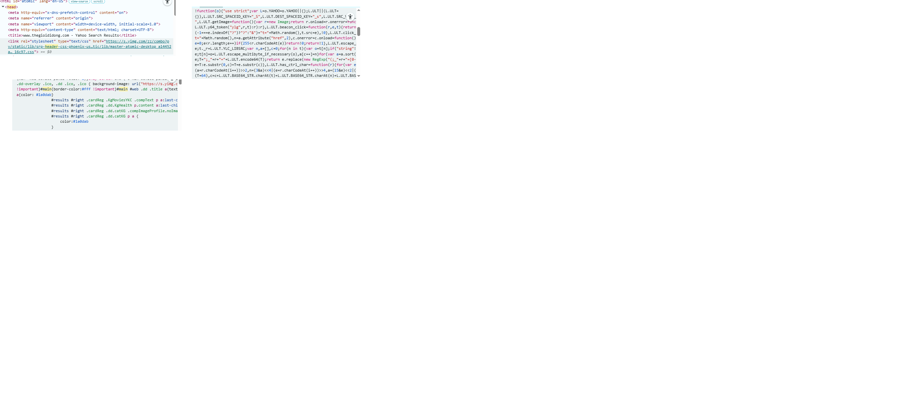
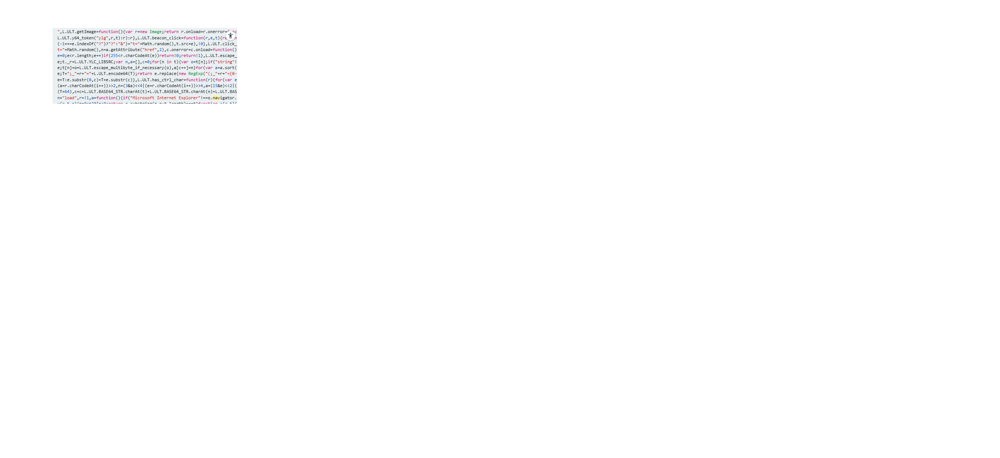
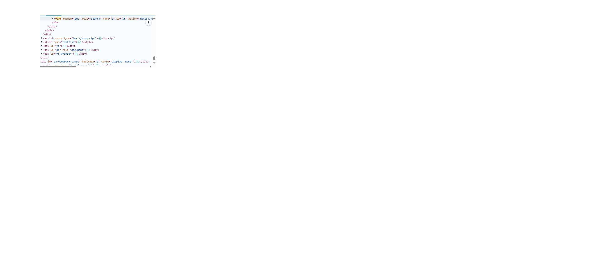

#answers.md
## Câu A1 - HTTP & Browser
### 1. Các bước khi nhập https://Shopee.vn
(Tham chiếu: 01_introduction_html_universe.md - phần How the Web Works)
1. DNS Lookup - chuyển domain thành IP
2. Thiết lập kết nối TCP 
3. TLS Handshake (HTTPS)
4. Gửi HTTP Request
5. Server trả về HTTP Response
6. Trình duyệt parse HTML
7. Tải CSS, JS
8. Render trang 
---
### 2. Tab Network hiển thị gì ?
(Tham chiếu: phần Browser DevTools)
- Danh sách request
- Status Code
- Thời gian load
- Loại file (CSS, JS, ảnh...)
---
### 3. Screenshot
Xem file: networl_screenshot.png

## Câu A2 
### Trang web bị SEO thấp vì:
1. Sử dụng quá nhiều thẻ 
 không có ý nghĩa 
2. Không giúp google hiểu cấu trúc trang 
3. Không xác định được đâu là header, nội dung chính, footer
4. Không có semantic rõ ràng cho sản phẩm 
### Lỗi 1: Dùng 
 thay cho header
    

### Lỗi 2: Menu không dùng <nav>
    

### Lỗi 3: Nội dung chings không dùng <main> 
    

### Lỗi 4: Sản phẩm không dùng <article>
    

### Lỗi 5: Tiêu đề không dùng <h1>, <h2>
    
 iphone 16 Pro
   
### Lỗi 6: Footer không dùng <footer>
    

### Lỗi 7: Ảnh không có alt
         

## Câu A3: Kết quả hiển thị Text Art
Hộp 1
Text A Text B
Hộp 2
Text C Text D
Hộp 3     

## Câu A4: 
### Sự khác nhau
1. <thead>:
Phần đầu của bảng 
Chứa phần tiêu đề của bảng 
Thường gồm các cột 
Hiển thị ở trên cùng
2. <tbody>
Phần thân của bảng 
Chứa dữ liệu chính của bảng 
Là phần lớn nội dung
3. <rfoot>
Phần cuối của bảng
Thường dùng để (tổng kết, ghi chú)
### Không nên dùng table để tạo layout vì:
1. Không đúng semantic
<table> dùng cho dữ liệu dạng bảng 
Dùng cho layout làm sai mục đích HTML
SEO kém vì Google khó hiểu cấu trúc.

2. Khó bảo trì 
Code dài, rối
Lồng nhiều <tr>, <td> phức tạp
Khó sửa khi thay đổi giao diện 

3. Không responsive tốt 
Table không linh hoạt trên mobile
Khó co giãn theo màn hình

4. Hiệu năng kém 
Trình duyệt phải render toàn bộ bảng mới
hiển thị 
Load chậm hơn so với CSS layout

## Câu B3
Lỗi 1: Dòng 1 sai khai báo DOCTYPE (<!DOCTYPE>) - Sửa thành <!DOCTYPE html>

Lỗi 2: Dòng 2 — Thiếu thuộc tính ngôn ngữ — Thêm lang="vi" vào thẻ <html>

Lỗi 3: Dòng 4 — Thẻ <title> không đóng — Thêm </title>

Lỗi 4: Dòng 5 — Sai charset "utf8" — Sửa thành "UTF-8"

Lỗi 5: Dòng 8 — Thẻ <h1> không đóng đúng — Sửa </h1>

Lỗi 6: Dòng 11 — Thẻ <a> không đóng — Sửa thành </a>

Lỗi 7: Dòng 18 — Thuộc tính src không có dấu ngoặc kép — Sửa thành src="iphone.jpg"

Lỗi 8: Dòng 20 — Lồng thẻ sai (<b> không đóng đúng vị trí) — Sửa thành <b>...</b> nằm trong 

Lỗi 9: Dòng 26,27,30,31 — Bảng dùng <td> cho header — Sửa thành <th>

Lỗi 10: Dòng 36 — Dùng 2 thẻ <main> — Thay cái thứ 2 bằng <aside>

Lỗi 11: Dòng 41 — Thẻ 
 trong footer không đóng — Thêm 

Lỗi 12: Thiếu thẻ đóng </html> — Bổ sung ở cuối file

Lỗi 13: Semantic — <h3> dùng không hợp lý (không có h2 trước) — Sửa thành <h2>

## Câu B4
# BÀI B4 — PHÂN TÍCH TRANG WEB

## 1. Semantic HTML5 (3 thẻ)

### ✔ Thẻ 1: <header>
- Vị trí: Phần đầu trang (logo + menu)
- Chức năng: chứa nội dung giới thiệu và điều hướng
- Nhận xét: Dùng đúng semantic

### ✔ Thẻ 2: <nav>
- Vị trí: menu danh mục sản phẩm
- Chức năng: chứa các link điều hướng
- Nhận xét: Dùng đúng semantic

### ✔ Thẻ 3: <main>
- Vị trí: phần nội dung chính
- Chức năng: hiển thị sản phẩm
- Nhận xét: Chỉ nên có 1 thẻ <main>

---

## 2. Thẻ dùng chưa đúng semantic (2 lỗi)

###  Lỗi 1: Dùng 
 thay vì semantic
- Ví dụ: 

- Vấn đề: không mang ý nghĩa
- Đề xuất: dùng <section> hoặc <article>

###  Lỗi 2: Dùng  cho nội dung chính
- Vấn đề:  chỉ là inline
- Đề xuất: dùng 
 hoặc <h2>, <h3>

---

## 3. Phân tích <table>

- Nội dung: hiển thị thông tin sản phẩm
- Nhận xét:
  - Trang KHÔNG dùng <table>
  - Thay vào đó dùng 
 + CSS
- Nếu có:
  - <thead>: tiêu đề
  - <tbody>: nội dung

---

## 4. Phân tích <form>

###  Chức năng
- Ô tìm kiếm sản phẩm

###  action & method
- action: /search (hoặc URL tương tự)
- method: GET

###  Input types
- type="text"
- type="submit"
- Có thể có:
  - type="search"
  - type="hidden"

## Câu C1
<!DOCTYPE html>
<html lang="vi">
<head>
    <meta charset="UTF-8">
    <title>Chi tiết sản phẩm</title>
</head>
<body>
    <!-- header: chứa logo, menu chính của trang -->
    <header>
        <h1>Logo / Tên website</h1>
        <!-- nav: khu vực điều hướng chính -->
        <nav>
            <ul>
                <li><a href="#">Trang chủ</a></li>
                <li><a href="#">Danh mục</a></li>
                <li><a href="#">Liên hệ</a></li>
            </ul>
        </nav>
    </header>
    <!-- nav breadcrumb: điều hướng dạng đường dẫn -->
    <nav aria-label="breadcrumb">
        <ol> <!-- ol vì breadcrumb có thứ tự -->
            <li><a href="#">Trang chủ</a></li>
            <li><a href="#">Điện thoại</a></li>
            <li>iPhone 16</li>
        </ol>
    </nav>
    <!-- main: nội dung chính của trang -->
    <main>
        <!-- section: nhóm nội dung chính của sản phẩm -->
        <section>
            <!-- article: 1 sản phẩm độc lập -->
            <article>
                <!-- figure: nhóm ảnh sản phẩm -->
                <figure>
                    <!-- img: hiển thị ảnh -->
                    
                    
                    
                    
                                      
                    <!-- figcaption: mô tả cho ảnh -->
                    <figcaption>Hình ảnh sản phẩm</figcaption>
                </figure>
                <!-- section: thông tin sản phẩm -->
                <section>
                    <h2>Tên sản phẩm</h2> <!-- h2: tiêu đề chính của sản phẩm -->
                    
Giá: ...
 <!-- p: đoạn văn bản -->
                    <!-- div: nhóm thông tin nhỏ (không có semantic riêng) -->
                    

                        ⭐ 4.5/5 <!-- span: inline text -->
                    

                    
Mô tả sản phẩm...

                </section>
                <!-- section: bảng thông số kỹ thuật -->
                <section>
                    <h3>Thông số kỹ thuật</h3>
                    <!-- table: dữ liệu dạng bảng -->
                    <table>
                        <thead>
                            <tr>
                                <th>Thuộc tính</th>
                                <th>Giá trị</th>
                            </tr>
                        </thead>
                        <tbody>
                            <tr>
                                <td>Màn hình</td>
                                <td>...</td>
                            </tr>
                            <tr>
                                <td>Pin</td>
                                <td>...</td>
                            </tr>
                        </tbody>
                    </table>
                </section>
                <!-- section: đánh giá / bình luận -->
                <section>
                    <h3>Đánh giá</h3>
                    <!-- article: mỗi bình luận là 1 nội dung độc lập -->
                    <article>
                        
<strong>Người dùng A:</strong> Sản phẩm tốt

                    </article>
                    <article>
                        
<strong>Người dùng B:</strong> Rất hài lòng

                    </article>
                </section>
            </article>
        </section>
        <!-- aside: nội dung phụ (sidebar) -->
        <aside>
            <h3>Sản phẩm tương tự</h3>
            <!-- article: mỗi sản phẩm tương tự -->
            <article>
                
Tên sản phẩm 1

            </article>
            <article>
                
Tên sản phẩm 2

            </article>
        </aside>
    </main>
    <!-- footer: chân trang -->
    <footer>
        
© 2026 Website của bạn

    </footer>
</body>
</html>  

## Câu C2:
Ý kiến “dùng 
 cho mọi thứ” nghe tiện, nhưng về lâu dài lại gây nhiều vấn đề kỹ thuật. Thứ nhất là SEO. Các công cụ tìm kiếm như Google dựa vào cấu trúc semantic (<header>, <main>, <article>, <nav>) để hiểu nội dung trang. Nếu mọi thứ đều là 
, trang sẽ mất “ngữ nghĩa”, khiến bot khó xác định đâu là nội dung chính, đâu là điều hướng → ảnh hưởng xếp hạng tìm kiếm. Thứ hai là Accessibility. Các công cụ hỗ trợ như NVDA hay JAWS cần semantic HTML để đọc và điều hướng cho người khiếm thị. Ví dụ, khi dùng <nav> hoặc <button>, screen reader có thể thông báo đúng chức năng; còn 
 thì không, trừ khi phải thêm rất nhiều ARIA phức tạp.

Một ví dụ cụ thể: khi xây dựng trang bài viết, dùng <article> bao quanh nội dung và <header> cho tiêu đề giúp cả SEO lẫn screen reader hiểu rõ đây là một bài độc lập. Nếu chỉ dùng 
, bạn phải “giải thích lại” bằng class và ARIA, vừa dài dòng vừa dễ sai.

Tuy vậy, 
 vẫn có chỗ đứng. Nó phù hợp khi chỉ cần group layout thuần túy, ví dụ chia grid, flexbox, hoặc wrapper cho styling mà không mang ý nghĩa nội dung. Tóm lại, semantic HTML không phải “tốn thời gian”, mà là đầu tư để code rõ ràng, dễ bảo trì và thân thiện hơn với cả máy lẫn người.